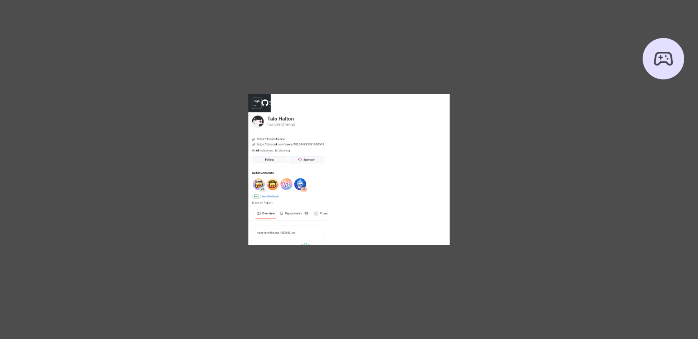




This started as a thought experiment of how I could use define UI in Godot using Compose (or Compose-like) syntax, using the [Godot Kotlin/JVM](https://github.com/utopia-rise/godot-kotlin-jvm) project, and evolved into a project to display [SinkSabre](TODO) directly within [BeatSource](TODO).

1. Implement a Godot UI framework in Kotlin, making it as close to the Compose-API as possible

I thought it would be fairly easy to get a basic prototype written and working, with basic layout structures and modifiers, I couldn't think of a way to have logic placed directly within Composable functions work (as in, not in a modifier lambda or a side effect).
So while this might have worked with some very basic layouts, many would still need reworking. In other words, it wouldn't be worth the work to, effectively, design and implement a UI framework from scratch.

2. Using Compose Multiplatform directly

I knew that Godot Kotlin/JVM would technically allow me to include Compose Multiplatform in a Godot project, but that I would have to either find a way of getting AWT/Swing to work nicely in Android, or implement a new Compose target specifically for Godot. I've a decent amount of digging into Compose's source code, but not enough to know how to do that (or even know if it would be possible).

3. Display a Compose/WASM application in a webview

Compose can be compiled to WASM, and surely there's a webview library for Godot, so that should work, right? Turns out there are webview libaries, but none of them are for Android, so I started work on an implementation myself.

By creating a [Godot Android plugin](https://docs.godotengine.org/en/stable/tutorials/platform/android/android_plugin.html) and creating a native Android webview (without displaying it directly), then drawing it to a bitmap and passing the binary data back to Godot, I was able to draw the webview to a Godot node, like a TextureRect. The catch for this was that the drawing method didn't work when the webview was displaying any Compose/WASM content. I verified this by displaying the webview directly as a regular Android view, which worked just fine. A print statement I added to the main function was outputted, so it was definitely running the program, just not drawing it to the bitmap correctly.

The code for this PoC can be seen in the [initial state](https://github.com/toasterofbread/godot-compose-example/tree/8dbbb33eb4c6f7c86c8bb958699be53da197be21) of the example repository.

4. Rendering a view with Jetpack Compose content

It was at that point when I realised that if I was able to display arbitrary Android view content as a Godot node, I could just compile my Compose project as an Android library and render it through the Godot plugin that way. Wish I'd thought of it earlier, but better late than never.

From there, I swapped the webview out for some Compose UI, then added code to forward any mouse/touch inputs on the Godot node to the Android view (which was surprisingly easy, although I haven't tested swipe gestures yet), and got everything working without much trouble.

<image src="images/compose.png" height=500>
